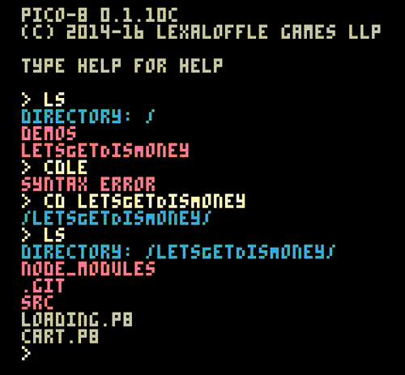

# getDisMoney-community-edition

Community Edition of [Get Dis Money](https://getdismoney.com). This is an open source version of [Get Dis Money](https://getdismoney.com), it is meant to give back to the pico-8 communitty, by offering my helper functions, game logic, and letting others try the game before they buy it.

It lacks the following features:

* Co op
* Stats
* Shop
* Looping
* Forced to run at 30fps
* And other small things

This project is built using [pico8Grunt](https://github.com/TeamNoComplyGames/pico8Grunt)

More README Coming Soon!
